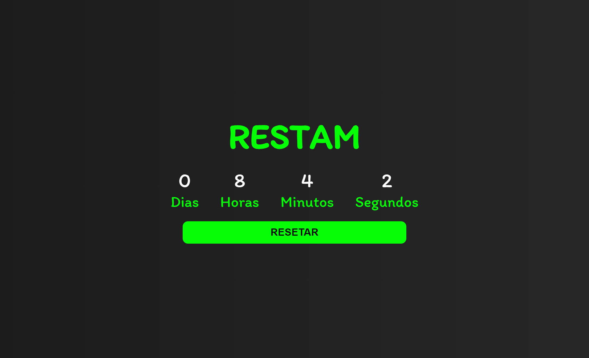

# Regressive-Counter
 Projeto desenvolvido para fins de estudos em Programação Orientada a Objetos.

> Contador

## 🔨 TECNOLOGIAS
* HTML
* CSS
* JavaScript

[🔗 Clique aqui para acessar](https://wesleydrc.github.io/Regressive-Counter)

> 📚 APRENDIZADO

* Utilização de classes do JavaScript para implementação de estados e comportamentos de um determinado objeto.

> FUNCIONALIDADES

* Contar regressivamente até a data especificada pelo usuário.
